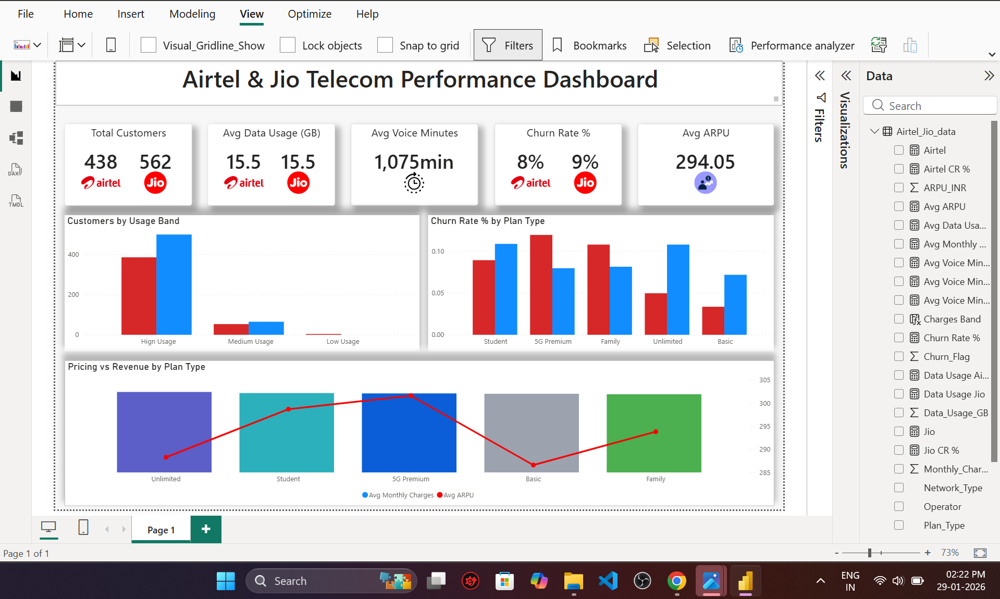

# 📊 Airtel & Jio Telecom Performance Dashboard | Power BI

An end-to-end **Telecom Analytics Power BI Dashboard** comparing **Airtel vs Jio** across customer behavior, revenue, usage patterns, and churn insights.

This project demonstrates real-world **business intelligence**, **KPI design**, and **data storytelling** using a telecom dataset.

---

## 🚀 Project Objective

To help telecom stakeholders:
- Track customer base & usage trends
- Identify churn-prone plans
- Compare ARPU and pricing effectiveness
- Make data-driven strategic decisions

---

## 🛠 Tools & Technologies

- **Power BI**
- **DAX**
- **Data Modeling**
- **Data Visualization**
- **Business Intelligence**

---

## 📂 Dataset Overview

- Operators: **Airtel & Jio**
- Customer usage data
- Plan types (Student, Family, Unlimited, 5G Premium, Basic)
- Revenue & pricing
- Churn indicators

---

## 📌 Key KPIs

- **Total Customers** (Airtel vs Jio)
- **Average Data Usage (GB)**
- **Average Voice Minutes**
- **Churn Rate (%)**
- **Average ARPU (₹)**

---

## 📈 Dashboard Insights

### 🔹 Customers by Usage Band
- High / Medium / Low usage comparison
- Jio shows stronger high-usage dominance

### 🔹 Churn Rate by Plan Type
- Higher churn in **Student & Basic** plans
- **Unlimited plans** perform better in retention

### 🔹 Pricing vs Revenue Analysis
- ARPU vs Monthly Charges comparison
- Premium plans generate higher value per user

---

## 🎯 Business Insights

- Target churn-prone plans with retention offers
- Optimize pricing for mid-tier plans
- Focus marketing on high-usage customers

---

## 📷 Dashboard Preview

---

## 🧠 Skills Demonstrated

- KPI Design & Optimization
- DAX Calculations
- Visual Layout & UX
- Business Insight Generation
- Telecom Domain Understanding

---

## 🔗 Connect With Me

- **LinkedIn:** ([Click here](https://www.linkedin.com/in/ravi-kumar-07sk/))
- **Portfolio:** ([Click here](https://ravikumarportf.netlify.app/))

⭐ If you like this project, don’t forget to **star the repository**!
