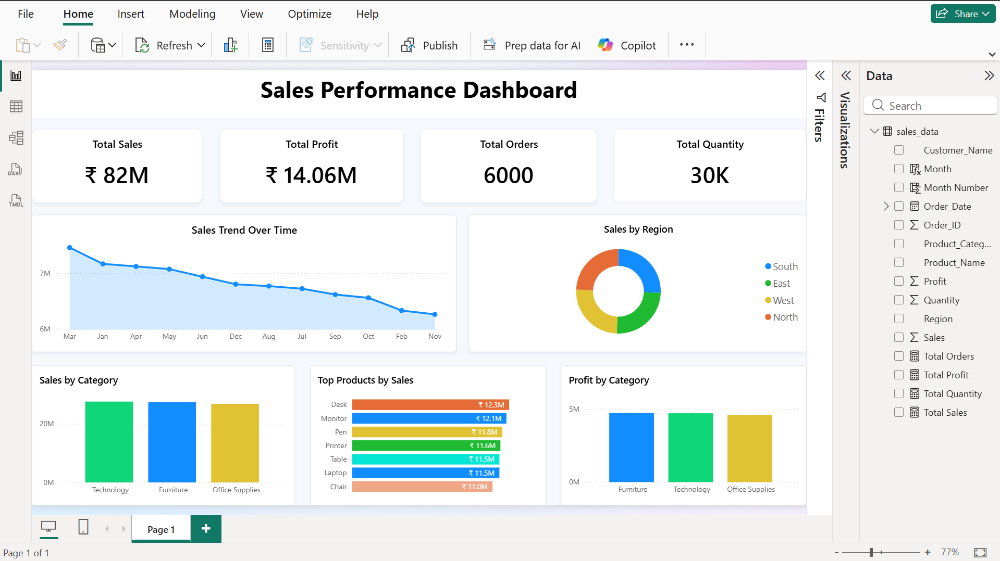

# 📊 Sales Performance Dashboard – Power BI

## 📌 Project Overview
This Power BI dashboard analyzes sales performance using key business metrics such as total sales, profit, orders, quantity, and category-wise insights.

## 📈 Key KPIs
- Total Sales: ₹82M  
- Total Profit: ₹14.06M  
- Total Orders: 6000  
- Total Quantity: 30K  

## 🧩 Dashboard Features
- Sales trend over time
- Sales by region
- Sales & profit by category
- Top products by sales

## 🖼️ Dashboard Screenshot

## 🛠 Tools Used
- Power BI
- Excel / CSV
- Data Modeling & DAX

## 📂 Files Included
- `sales-dashboard.pbix` – Power BI dashboard
- `sales_data.csv` – Dataset
- `sales-db-image.png` – Dashboard screenshot

## 🚀 How to Use
1. Download the `.pbix` file
2. Open in Power BI Desktop
3. Refresh data if required

## 👤 Author
**Ravi Kumar**  
